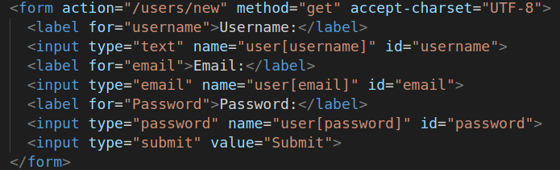
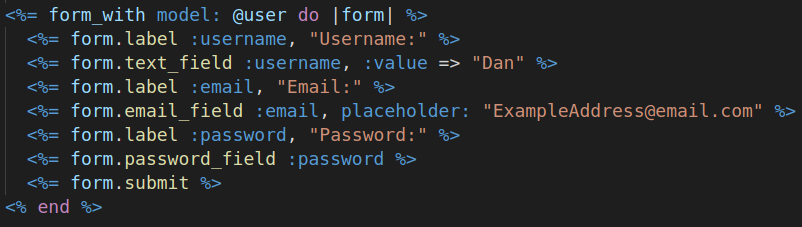

# HTML Vs. Rails Forms

This was to practice the difference between the HTML and Rails ways to build forms.

### Screenshots

  <figure>
    <figcaption>HTML form for new user</figcaption>
    
  </figure>
  <figure>
    <figcaption>Rails form for new user</figcaption>
    
  </figure>

